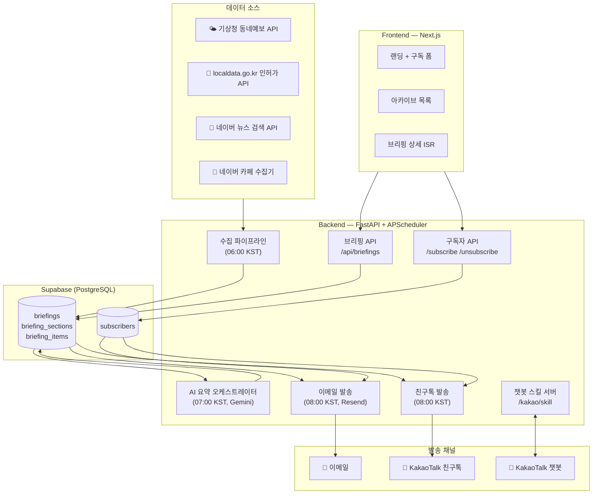
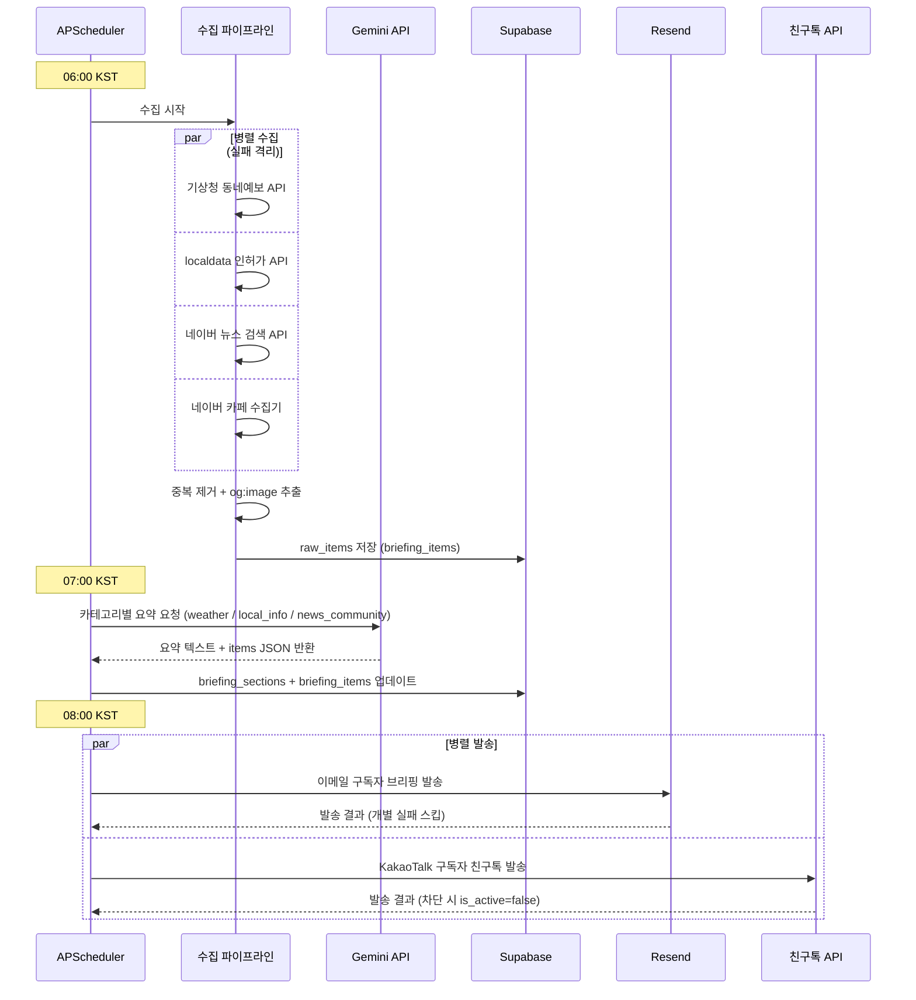

# dongne.me MVP — 일일 동네 브리핑 Spec

## Purpose

공공 OpenAPI, 지역 뉴스, 동네 커뮤니티 데이터를 자동 수집해 AI가 동네별로 요약하고, 매일 아침 이메일로 발송하는 하이퍼로컬 구독 서비스. MVP는 영통구(수원시) 단일 지역으로 핵심 가설("AI 자동 브리핑 구독 수요가 있다")을 검증한다.

타겟 사용자: 아주대 재학생 및 영통구 거주자. 6주 내 구독자 100명, 주간 오픈율 30% 이상 달성이 MVP 성공 기준.

---

## System Architecture



---

## Requirements

### Functional

- REQ-1: 매일 오전 8시, 영통구 기준 브리핑을 자동 생성해 이메일 구독자와 KakaoTalk 채널 구독자 전체에게 발송한다
- REQ-2: 브리핑은 날씨(기상청), 생활 인허가 정보(localdata.go.kr), 지역 뉴스 + 커뮤니티(네이버 뉴스 + 네이버 카페) 3개 카테고리를 포함한다
- REQ-3: 각 카테고리별로 AI가 핵심 내용을 3~5줄로 요약하고 원문 링크를 첨부한다
- REQ-4: 웹 아카이브는 구독 여부 무관 누구나 접근 가능하며, 동네를 선택해 해당 동네의 브리핑을 열람할 수 있다 (MVP: 영통구만 데이터 있음)
- REQ-5: 이메일 주소만으로 이메일 구독 신청/해지가 가능하다 (별도 회원가입 없음, double opt-in)
- REQ-6: 구독 신청 시 확인 이메일을 발송하고 링크 클릭 후 구독이 활성화된다
- REQ-7: 이메일 내 해지 링크로 즉시 이메일 구독 해지가 가능하다
- REQ-8: KakaoTalk 채널을 친구 추가하면 KakaoTalk 구독이 즉시 활성화되고 웰컴 메시지가 발송된다
- REQ-9: 매일 오전 8시 KakaoTalk 채널 구독자에게 친구톡(Friendtalk)으로 브리핑을 자동 발송한다
- REQ-10: KakaoTalk 챗봇에서 명령어로 즉석 브리핑 조회 및 구독 해지가 가능하다 (지원 명령어: "오늘 브리핑", "구독 해지", "도움말")

### Non-Functional

- NFR-1: 일일 자동 발송 성공률 99% 이상 (월 기준 최대 30분 다운타임 허용)
- NFR-2: 수동 검수 기준 정보 정확도 90% 이상 (AI 오류·환각 포함)
- NFR-3: 이메일 발송 시각 오전 8:00 ± 10분 이내

---

## UI / Interaction

### 웹 페이지 구조

| 경로 | 역할 | 핵심 요소 |
|---|---|---|
| `/` | 랜딩 | 서비스 소개 + 이메일 구독 폼 + 최근 브리핑 미리보기 |
| `/briefings` | 아카이브 목록 | 동네 선택 드롭다운 + 날짜별 브리핑 카드 리스트 |
| `/briefings/[neighborhood]/[date]` | 브리핑 상세 | 해당 날짜 전체 브리핑 (카테고리별 섹션) |
| `/confirm` | 구독 확인 | 이메일 확인 링크 도달 → 구독 완료 안내 |
| `/unsubscribe` | 해지 | 이메일 해지 링크 도달 → 해지 완료 안내 |

### 랜딩 미리보기 (Patch.com 스타일)

랜딩 페이지 하단에 가장 최근 브리핑의 실제 데이터를 기사 카드 형태로 표시한다.

```
┌──────────────────────────────────┐
│ [썸네일 이미지]  제목 한 줄       │
│                 AI 요약 1~2줄    │
│                 카테고리 태그     │
└──────────────────────────────────┘
```

- 썸네일: 뉴스 기사 og:image, 없으면 카테고리별 기본 이미지
- 카드 당 제목 + AI 요약 1~2줄 + 카테고리 태그
- 최신 3~5개 아이템 표시

### KakaoTalk 챗봇

**채널 구조:**
- 카카오 i 오픈빌더로 챗봇 구축, 카카오 비즈니스 채널과 연결
- 친구톡(Friendtalk): 채널 구독자에게 하루 1회 자동 발송 (마케팅 메시지)
- 스킬 서버: FastAPI `/kakao/skill` 엔드포인트 → 오픈빌더에서 호출

**KakaoTalk 구독 플로우:**
```
채널 검색 "동네 브리핑" → 친구 추가
→ 웰컴 메시지 (채널 추가 이벤트 webhook 수신 시 자동 발송)
   "안녕하세요! 동네 브리핑입니다.
    매일 오전 8시 영통구 소식을 보내드립니다.
    '도움말'을 입력하면 이용 방법을 안내해드려요."
→ 다음 날 오전 8시부터 친구톡 수신 시작
```

**챗봇 명령어 (MVP):**

| 명령어 | 응답 |
|---|---|
| `오늘 브리핑` | 오늘 브리핑 3개 카테고리 요약 + 웹 상세 링크 |
| `구독 해지` | 확인 안내 후 즉시 채널 구독 해지 처리 |
| `도움말` | 사용 가능한 명령어 목록 안내 |
| 그 외 입력 | "아직 이 명령어를 지원하지 않습니다. '도움말'을 입력해주세요." |

**친구톡 메시지 구조:**
```
[동네] 2026.06.08(월) 영통구 브리핑

🌤 날씨: 맑음, 최고 28°C. 미세먼지 좋음.
🏪 생활: 영통2동 신규 음식점 2곳 영업 개시.
📰 뉴스: 영통구 도서관 하계 특강 신청 시작...

자세히 보기 → dongne.me/briefings/영통구/2026-06-08
```

> 친구톡은 채널 구독자(친구)에게만 발송 가능. 비구독자에게는 발송 불가.

### 이메일 템플릿

- **제목**: `[동네] 2026.06.08(월) 영통구 브리핑`
- **구조**:
  1. 헤더: 날짜 + 동네명 + 간단 한 줄 인트로
  2. 날씨 섹션 🌤: AI 요약 + 기온/강수/미세먼지 핵심 수치
  3. 생활 정보 섹션 🏪: AI 요약 + 신규/폐업 인허가 주요 변동 + 원문 링크
  4. 지역 뉴스 + 커뮤니티 섹션 📰: 썸네일 + 한 줄 제목 + AI 요약 (기사 2~3개 + 카페 글 1~2개)
  5. 푸터: "구독 해지" 링크 + 서비스 소개 한 줄

### 사용자 플로우

```mermaid
flowchart TD
    subgraph EMAIL["📧 이메일 구독"]
        E1([랜딩 방문]) --> E2[이메일 입력]
        E2 --> E3{이미 구독?}
        E3 -->|Yes| E4[이미 구독 중 안내]
        E3 -->|No| E5[확인 이메일 발송]
        E5 --> E6[링크 클릭 /confirm]
        E6 --> E7[구독 활성화]
        E7 --> E8[매일 08:00 브리핑 수신]
        E8 --> E9[해지 링크 클릭 /unsubscribe]
        E9 --> E10[즉시 해지 + 재구독 링크]
    end

    subgraph KAKAO["💛 KakaoTalk 구독"]
        K1([채널 친구 추가]) --> K2[webhook 수신\nsubscribers INSERT]
        K2 --> K3[웰컴 메시지 발송]
        K3 --> K4[매일 08:00 친구톡 수신]
        K4 --> K5{챗봇 명령어}
        K5 -->|오늘 브리핑| K6[브리핑 요약 + 링크 응답]
        K5 -->|구독 해지| K7[즉시 해지 처리]
        K5 -->|도움말| K8[명령어 목록 안내]
        K5 -->|기타| K9[폴백 응답]
        K1x([채널 차단]) --> K10[is_active=false\n발송 중단]
    end

    subgraph ARCHIVE["🗂 아카이브 열람 (비로그인)"]
        A1([dongne.me/briefings 접근]) --> A2[동네 선택 드롭다운]
        A2 --> A3{데이터 있는 동네?}
        A3 -->|Yes| A4[날짜별 카드 목록]
        A3 -->|No| A5[준비 중 안내]
        A4 --> A6[날짜 카드 클릭]
        A6 --> A7{오전 8시 이후?}
        A7 -->|Yes| A8[브리핑 상세 열람]
        A7 -->|No| A9[8시 공개 예정 안내]
    end
```



### 빈 상태 / 로딩 처리

- 오전 8시 이전 오늘 브리핑 접근: "오늘 브리핑은 오전 8시에 공개됩니다"
- 특정 카테고리 API 실패: "현재 [카테고리] 정보를 가져올 수 없습니다"
- 뉴스 없는 날: "오늘 영통구 관련 뉴스가 없습니다"
- 데이터 없는 동네 선택 시: "아직 [동네] 서비스가 준비되지 않았습니다. 영통구 브리핑을 먼저 이용해보세요"

---

## Data Contracts

### 수집 파이프라인



### Public APIs

| API | 기관 | 데이터 | 상태 |
|---|---|---|---|
| 동네예보 API | 기상청 (data.go.kr) | 기온, 강수확률, 풍속, 미세먼지 | 무료, 키 발급 필요 |
| 지방행정 인허가 정보 API | localdata.go.kr | 음식점·의료기관 등 신규/폐업/영업정지 | 무료, 법정동 코드 필터 |
| 법정동코드 연계정보 API | 행정안전부 (data.go.kr) | 시·도~읍·면·동 행정구역 코드 | 무료 |
| 뉴스 검색 API | 네이버 개발자센터 | 지역 뉴스 기사 | 무료 25,000건/일 |
| 카페 게시글 수집 | 네이버 (비공식) | 지역 카페 공개 게시글 | **ToS 리스크 — 공개 게시판만, 인증 불필요 대상만 수집** |

> **네이버 카페 수집 정책**: 공개(비로그인 접근 가능) 게시판만 수집. 로그인이 필요한 카페는 제외. 수집 간격 ≥ 1초. 실패 시 해당 소스만 스킵하고 전체 발송은 유지.

### 백엔드 엔드포인트 (KakaoTalk 스킬 서버)

```
POST /kakao/skill          ← 오픈빌더 스킬 호출 (명령어 처리)
POST /kakao/webhook/friend ← 친구 추가/차단 이벤트 수신
```

### DB 스키마 (Supabase)

```
subscribers
  id              uuid PK
  email           text UNIQUE nullable   (이메일 구독자)
  kakao_user_key  text UNIQUE nullable   (KakaoTalk 구독자 식별자)
  channel         text                   (email | kakao | both)
  is_active       boolean default false
  confirm_token   text UNIQUE nullable   (이메일 double opt-in용)
  created_at      timestamptz

briefings
  id              uuid PK
  date            date
  neighborhood    text           (MVP: "영통구")
  created_at      timestamptz
  UNIQUE(date, neighborhood)

briefing_sections
  id              uuid PK
  briefing_id     uuid FK → briefings.id
  category        text           (weather | local_info | news_community)
  summary         text           (AI 생성 요약)
  raw_items       jsonb          (원본 데이터 배열)

briefing_items    ← 카드 단위 (랜딩 미리보기 + 이메일 카드에서 사용)
  id              uuid PK
  section_id      uuid FK → briefing_sections.id
  title           text
  summary_short   text           (1~2줄 요약)
  source_url      text
  thumbnail_url   text           (og:image 추출 결과, nullable)
  published_at    timestamptz
  source_type     text           (news | cafe | public_api)
```

### AI 요약 출력 스키마

```json
{
  "category": "weather | local_info | news_community",
  "summary": "3~5줄 한국어 요약 텍스트",
  "items": [
    {
      "title": "원문 제목",
      "summary_short": "1~2줄 요약",
      "source_url": "https://...",
      "thumbnail_url": "https://... (nullable)",
      "published_at": "2026-06-08T00:00:00Z",
      "source_type": "news | cafe | public_api"
    }
  ]
}
```

---

## Edge Cases & Error States

- EDGE-1: 기상청 API 실패 → 날씨 섹션 "현재 날씨 정보를 가져올 수 없습니다" + 나머지 섹션 정상 발송
- EDGE-2: localdata API 실패 → 생활정보 섹션 "현재 생활 정보를 가져올 수 없습니다" + 나머지 발송
- EDGE-3: AI(Gemini) 응답 실패 → 해당 카테고리 원문 제목 + 링크만 포함 (요약 없이 발송)
- EDGE-4: 이메일 발송 실패 (개별 주소) → 3회 재시도 후 해당 주소 스킵, 나머지 계속 발송
- EDGE-5: 이미 구독 중인 이메일 재신청 → "이미 구독 중인 이메일입니다" 안내 (확인 이메일 미재발송)
- EDGE-6: 이메일 형식 오류 입력 → 클라이언트 유효성 검사로 즉시 안내
- EDGE-7: 이미 해지된 토큰으로 해지 재접근 → "이미 해지된 구독입니다" 안내 (오류 아님)
- EDGE-8: 뉴스 없는 날 → "오늘 영통구 관련 뉴스가 없습니다" 표시 후 발송
- EDGE-9: 네이버 카페 수집 실패 (차단·세션 만료 등) → 해당 소스 스킵, 뉴스 섹션은 뉴스 기사만으로 발송
- EDGE-10: 데이터 없는 동네 선택 → "아직 [동네] 서비스가 준비되지 않았습니다" 안내
- EDGE-11: 친구톡 발송 실패 (개별 사용자) → 3회 재시도 후 스킵, 나머지 구독자 계속 발송
- EDGE-12: 채널 차단한 사용자에게 친구톡 발송 시도 → Kakao API 오류 응답 → DB에서 is_active=false 처리
- EDGE-13: 챗봇 스킬 서버 응답 지연 (5초 초과) → 오픈빌더 타임아웃 → "일시적 오류가 발생했습니다. 잠시 후 다시 시도해주세요." 폴백 응답
- EDGE-14: "오늘 브리핑" 명령 → 당일 브리핑 미생성(오전 8시 이전) → "오늘 브리핑은 오전 8시에 공개됩니다. 어제 브리핑을 보려면 [링크]" 응답

---

## Dependencies

- 기상청 동네예보 API — data.go.kr 계정 + API 키 (무료)
- localdata.go.kr 인허가 정보 API — 무료, 법정동 코드 기반 필터링
- 행정안전부 법정동코드 API — data.go.kr 무료 (동네 매핑 기준)
- 네이버 뉴스 검색 API — 네이버 개발자센터 앱 등록 (무료 25,000건/일)
- 네이버 카페 수집 — 비공식 방식, ToS 리스크. 공개 게시판 한정
- Google Gemini API — 유료. 비용 모니터링 필요 (MVP 규모는 저비용 예상)
- Resend — 이메일 발송. 무료 3,000건/월로 시작, 구독자 추이 보고 유료($20/월) 전환
- Supabase — DB. 무료 티어 충분 (MVP 규모)
- **카카오 비즈니스 채널** — 카카오 비즈니스 계정 + 채널 개설. **⚠️ 친구톡(Friendtalk) API 사용을 위해 카카오 파트너 신청 및 승인 필요 (심사 1~2주 소요). MVP 타임라인 영향 가능성 있음.**
- **카카오 i 오픈빌더** — 챗봇 구축 플랫폼. 무료. 비즈니스 채널과 연결 필요.
- **카카오 친구톡 API** — 채널 구독자 대상 자동 발송. 카카오 파트너 승인 후 사용 가능. 발송 단가 별도 (건당 약 15~20원).

> **KakaoTalk 일정 리스크**: 친구톡 API 승인이 MVP 6주 내 완료 안 될 경우, KakaoTalk은 챗봇(pull) 기능만 먼저 출시하고 친구톡 push는 승인 후 추가 배포한다.

---

## Out of Scope (MVP)

- 현재 위치 자동 감지 (geolocation)로 동네 자동 선택 — Phase 2
- 개인화 알림 설정 (관심 카테고리 선택)
- 지도 기반 UI
- 영통구 외 지역 데이터 수집 (UI는 동네 선택 지원, 데이터는 영통구만)
- 트렌드 분석 대시보드
- 모바일 앱 (PWA 포함)
- 안전/치안, 교통/도로 카테고리
- 유료 구독 / 광고
- 사용자 계정 (로그인)
- KakaoTalk 챗봇 고급 명령어 (동네 변경, 카테고리 필터, 히스토리 조회) — Phase 2
- 알림톡(Alimtalk) — 템플릿 사전 승인 필요, 트랜잭션 메시지 전용 → 현재 유스케이스에 불필요
